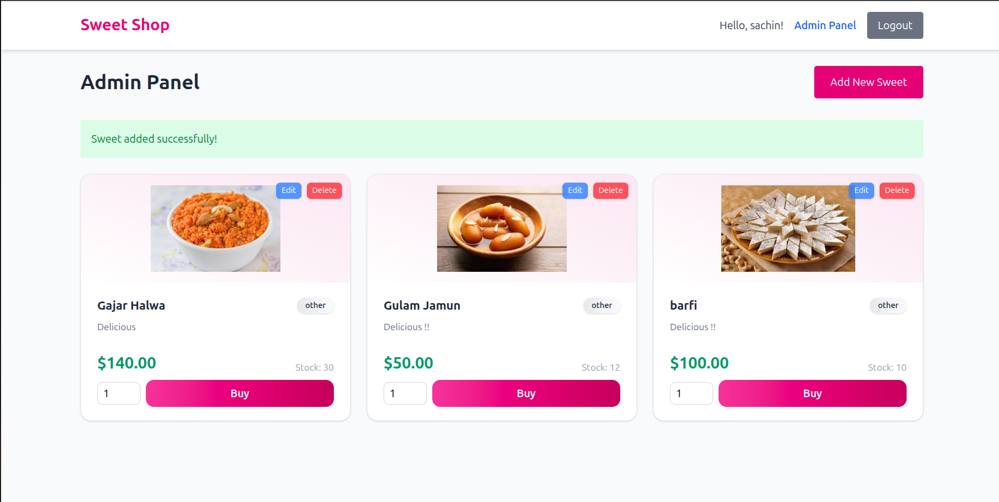

# Sweet Shop Management System

A full-stack CRUD application to manage a Sweet Shop.
It supports authentication, role-based access, and features like adding, editing, deleting, purchasing, and restocking sweets.

## 🚀 Features

- **Inventory Management**: Add, update, delete, and track sweets in your shop
- **Search & Filter**: Find products by name, category, and price
- **Stock Management**: Purchase and restock functionality with stock tracking
- **Responsive Design**: Works on desktop and mobile devices

---

## ⚡ Getting Started

### Prerequisites
- Node.js (>=18.x)  
- npm (>=8.x)  
- MongoDB running locally or MongoDB Atlas connection  

### Backend Setup
```bash
cd backend
npm install

### Frontend Setup
```bash
cd frontend
npm install


### Development

```bash
# Run development servers for all applications
npm run dev

# Build all packages and applications
npm run build

# Run tests across all packages and applications
npm run test
```

### Accessing the Application

- **API**: http://localhost:3000/api
- **Web Frontend**: http://localhost:5173

## 📊 Test Reports


## 📱 Application Screenshots

### Dashboard View


### Sweet Management Interface



### Adding New Sweet


### Edit and Restock Sweets


---

## 🤖 My AI Usage

As part of this assignment, I made use of AI tools to assist in specific parts of the project.  
Below are the details:

- **AI Tools Used**: ChatGPT  
- **How I Used Them**:  
  - I used ChatGPT to generate initial **test cases** for my backend services.  
  - I also used ChatGPT to help **design the frontend layout** for the Sweet Management application, including structuring React components and styling ideas.  
- **Reflection on AI Impact**:  
  Using AI tools improved my workflow by saving time on repetitive tasks like writing boilerplate tests and providing quick inspiration for frontend design patterns.  
  However, I carefully reviewed, modified, and validated all AI-generated content to ensure it fit the project requirements and coding standards.  
  Overall, AI acted as a helpful assistant but the final implementation decisions and code were written, debugged, and validated by me.  
